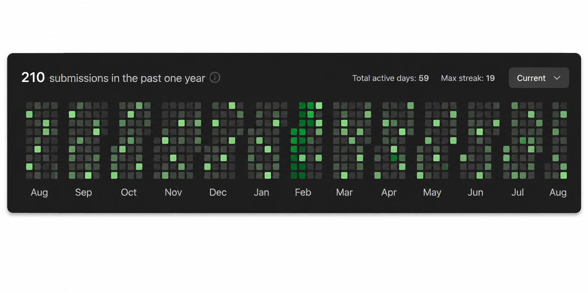

# 💫 About Me:
👋 About Me  Hi, I'm Ayan Dey, an M.Tech Computer Science student at Guru Nanak Institute of Technology, specializing in full-stack web development.  💻 I work with React.js, Java, Spring Boot, MySQL, JavaScript, HTML, and CSS, and I enjoy building responsive, database-driven web applications.  🚀 I've developed projects including a Library Management System, Online Voting System, and Tours & Travel Website, gaining hands-on experience in both front-end and back-end development.  🏆 I secured 1st Place in the Software Track at the Cryptonix V1 Inter-College Hackathon (2025) and completed an AI-ML Virtual Internship with Google.  ☁️ I'm also AWS Cloud Essentials certified and continuously learning new technologies to improve my development skills.  🎯 Currently seeking Full-Stack Developer or Software Engineer opportunities where I can build scalable, user-focused applications and grow as a software professional.

## 🌐 Socials:
    

# 💻 Tech Stack:
                                        
# 📊 GitHub Stats:
 
 

🏅 Achievements & Trophies

🏆 1st Place — Software Track, Cryptonix V1 Inter-College Hackathon, 2025
🥇 Full-Stack Developer — React.js, Spring Boot & MySQL
☁️ AWS Cloud Essentials Certified — Amazon Web Services
🤖 AI-ML Virtual Internship — Google, 2025–2026
💻 210+ LeetCode Submissions — Consistent problem-solving practice
🔥 19 Days — Maximum LeetCode Streak
📚 M.Tech Computer Science — CGPA 8.71/10
🎓 B.Tech Computer Science — CGPA 8.89/10
🚀 Full-Stack Projects — Library Management, Online Voting & Tours/Travel
🧠 Continuous Learner — Data Structures, Algorithms, Web Development & Cloud

🧩 LeetCode

  

## 🏆 GitHub Trophies

  

### ✍️ Random Dev Quote

### 🔝 Top Contributed Repo

---

<!-- Proudly created with GPRM ( https://gprm.itsvg.in ) -->
